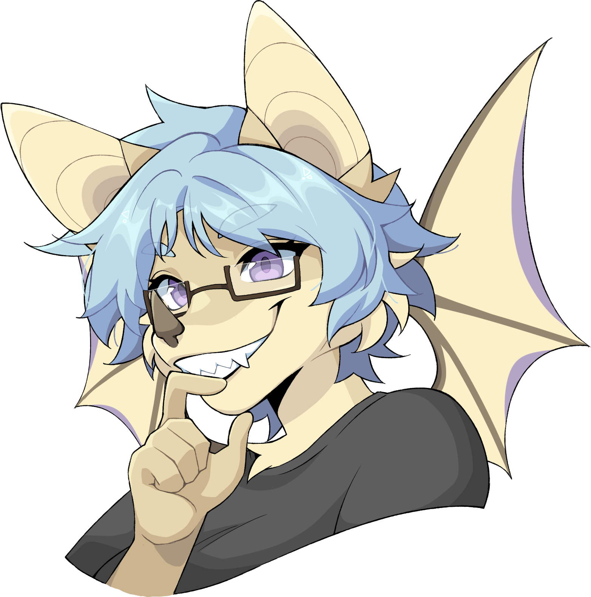

<h1 align="center">Hi there, I'm Reese! 👋</h1>

  <b>he/she/they | 22 | also on <a href="https://gitlab.com/renys">Gitlab</a>!</b>

  I'm a third year computer science university student. I have a need to experiment with <strong>everything</strong> when it comes to programming. I'm also a teaching assistant, where I encourage students to develop their problem-solving skills and share code demos with them on my <a href="https://replit.com/@renys">Replit account.</a>
    
  When I'm not developing, I play rhythm games (and sometimes FPS games) and listen to music (you can find out my music taste <a href="https://www.last.fm/user/i-dle">here~</a>).
    
  Side art by <a href="https://twitter.com/foxsnax">@foxsnax</a>, icon by <a href="https://twitter.com/fixy_cookies">@fixy_cookies</a>.
    
  Here are some things I have an interest in using/learning:
   
  
  
  
  
  
  
  

<!-- lastfm -->

          

